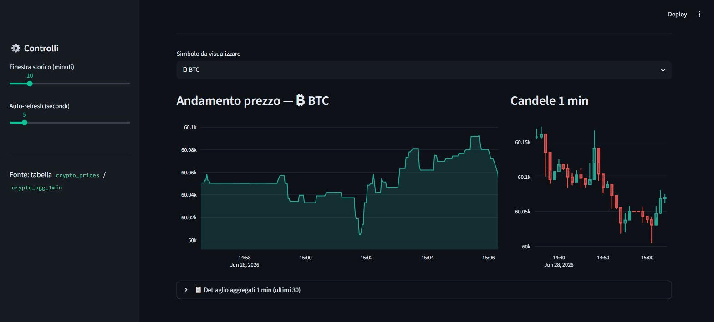
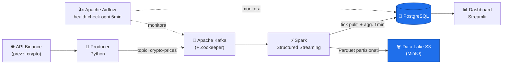

# 🪙 Real-Time Crypto Data Pipeline

Pipeline dati **real-time end-to-end** che acquisisce prezzi di criptovalute dall'API
pubblica di Binance, li elabora in streaming e li mostra su una dashboard live.
Progetto portfolio che integra **Big Data, Data Engineering, Cloud e fondamenti di MLOps**,
interamente containerizzato e avviabile con **un solo comando**.

> **Stack:** Python · Apache Kafka · Spark Structured Streaming · PostgreSQL · S3 (MinIO) · Apache Airflow · Streamlit · Docker

<!-- Sostituisci con una GIF reale della dashboard in funzione (vedi sezione "Demo"). -->
<!--  -->

---

## 🏗️ Architettura



**Il flusso in una frase:** il *producer* legge Binance e scrive su *Kafka*; *Spark* consuma
lo stream, lo pulisce e lo aggrega, scrivendo sia su *PostgreSQL* (per query veloci) sia sul
*data lake S3* (storico grezzo in Parquet); la *dashboard Streamlit* legge da PostgreSQL e
mostra i prezzi live; *Airflow* fa da guardiano con health check periodici.

---

## 🚀 Avvio rapido (one-command)

Requisiti: **Docker Desktop** attivo. Poi:

```bash
docker compose up -d --build
```

Questo singolo comando costruisce le immagini e avvia **l'intera pipeline**, producer incluso.
Al **primo avvio da pulito** Spark è lento (~1-2 min: scarica da zero tutti i connettori,
incluso l'aws-bundle ~280MB); ai riavvii successivi sono ~20-30s perché la cache resta sul
volume. È normale, non è bloccato: i dati iniziano ad arrivare in dashboard dopo questa fase.

Per fermare tutto (i dati restano sui volumi):

```bash
docker compose down
```

Per fermare **e cancellare anche i dati** (reset completo):

```bash
docker compose down -v
```

---

## 🔌 Servizi e porte

| Servizio | URL / Porta | Credenziali | A cosa serve |
|---|---|---|---|
| **Dashboard** (Streamlit) | http://localhost:8501 | — | Prezzi live, grafico, aggregati 1min |
| **Kafka UI** | http://localhost:8080 | — | Ispezionare topic e messaggi |
| **Airflow** | http://localhost:8081 | `admin` / `admin` | Orchestrazione e health check |
| **MinIO Console** (S3) | http://localhost:9001 | `minioadmin` / `minioadmin` | Esplorare il data lake Parquet |
| **PostgreSQL** | `localhost:5432` | `pipeline` / `pipeline` (db `crypto`) | Database della pipeline |
| **Kafka** (broker) | `localhost:9092` | — | Connessione dal PC host |

> ⏱️ Dopo `up -d` dai ~1 minuto a tutti i servizi per diventare "healthy".
> Apri prima la **Kafka UI** per vedere i messaggi arrivare, poi la **Dashboard**.

---

## 🧱 Stack tecnologico (e il ruolo di ognuno)

| Tecnologia | Ruolo nel progetto |
|---|---|
| **Python** | Producer: legge l'API e pubblica su Kafka |
| **Apache Kafka + Zookeeper** | Message broker real-time: disaccoppia chi produce da chi consuma |
| **Spark Structured Streaming** | Elaborazione e aggregazione dello stream a micro-batch |
| **PostgreSQL** | Database per query veloci a supporto della dashboard |
| **S3 / MinIO** | Data lake: archivio storico grezzo in Parquet (MinIO locale, switchabile su AWS) |
| **Apache Airflow** | Orchestrazione, scheduling e health check con alert |
| **Streamlit** | Dashboard web live sui dati |
| **Docker + docker-compose** | Containerizzazione e avvio one-command dell'intero stack |

---

## 📂 Struttura del repository

```
Progetto 3/
├── docker-compose.yml      # tutti i servizi della pipeline (one-command)
├── .env.example            # template variabili d'ambiente
├── producer/               # sorgente dati (Python → Kafka)
│   ├── stream_producer.py  #   legge Binance e pubblica su crypto-prices
│   ├── test_consumer.py    #   consumer di test per debug
│   └── Dockerfile          #   containerizza il producer
├── spark/
│   └── streaming_job.py     # job Spark: Kafka → PostgreSQL + S3
├── postgres/
│   └── init.sql            # crea le tabelle al primo avvio
├── airflow/
│   └── dags/               # DAG di health check della pipeline
├── dashboard/              # app Streamlit (app.py + Dockerfile)
└── docs/                   # immagini / GIF della demo
```

---

## 🗃️ Dati prodotti

Spark scrive su due tabelle PostgreSQL e sul data lake:

| Destinazione | Contenuto |
|---|---|
| `crypto_prices` (Postgres) | ogni tick pulito (append) |
| `crypto_agg_1min` (Postgres) | media / min / max / conteggio per simbolo, finestra di 1 minuto |
| `s3a://crypto-lake/crypto_prices/` (MinIO) | tick grezzi in **Parquet** partizionati per `dt=.../symbol=...` |

Esempio di query manuale:

```bash
docker exec postgres psql -U pipeline -d crypto \
  -c "SELECT * FROM crypto_agg_1min ORDER BY window_start DESC LIMIT 10;"
```

---

## ☁️ Passare ad AWS S3 reale

Il data lake usa **MinIO** (S3-compatibile, locale, costo zero). Per puntare ad AWS reale
basta cambiare le env del servizio `spark` in `docker-compose.yml`
(`S3_ENDPOINT`, `S3_ACCESS_KEY`, `S3_SECRET_KEY`, `S3_BUCKET`): **il codice resta identico**.

> ⚠️ S3 non è "always free": c'è solo il free tier 12 mesi (5 GB). Imposta un **budget alert** su AWS.

---

## 🩺 Health check con Airflow

Il DAG `crypto_pipeline_health` gira ogni 5 minuti e controlla:
**Kafka** (connessione TCP) · **PostgreSQL** (query) · **freschezza dati**
(fallisce con alert se non arrivano righe nuove da oltre 5 minuti).

Esecuzione manuale di test:

```bash
docker exec airflow-scheduler airflow dags test crypto_pipeline_health
```

---

## 🎬 Demo

Per registrare la GIF della dashboard: avvia lo stack, apri http://localhost:8501,
registra ~10-15s con uno screen recorder (es. ScreenToGif su Windows), salva in
`docs/demo.gif` e scommenta la riga `` in cima a questo README.

---

## 🛠️ Troubleshooting

| Sintomo | Causa / Soluzione |
|---|---|
| Spark sembra "bloccato" all'avvio (fino a ~1-2 min da pulito, ~20-30s ai riavvii) | Normale: sta scaricando i connettori (incl. aws-bundle ~280MB). La cache resta sul volume, quindi i riavvii sono molto più rapidi. Aspetta. |
| `NPE BlockManager` nei log Spark all'avvio | Errore transitorio innocuo, si auto-risolve. |
| La dashboard non mostra dati | Verifica che `producer` e `spark` siano `Up` (`docker compose ps`) e guarda i log: `docker logs -f producer`. |
| Binance risponde 400 | I simboli vanno passati come JSON compatto (già gestito nel codice). |
| Voglio cambiare i simboli seguiti | Modifica `SYMBOLS` nel servizio `producer` del compose e riavvia: `docker compose up -d producer`. |

---

## 🧪 Sviluppo: eseguire il producer fuori da Docker (opzionale)

Per iterare velocemente sul codice del producer senza ricostruire l'immagine, puoi
eseguirlo sul tuo PC (collegandosi a `localhost:9092`):

```bash
docker compose up -d --scale producer=0     # avvia lo stack SENZA il producer in container
python -m venv .venv
.venv/Scripts/python.exe -m pip install -r producer/requirements.txt   # Windows
.venv/Scripts/python.exe producer/stream_producer.py
```

---

## ✅ Stato di avanzamento

- [x] **Passo 1** — Fonte dati (crypto/Binance) + Kafka & Zookeeper in Docker
- [x] **Passo 2** — Producer Python → Kafka (+ consumer di test)
- [x] **Passo 3** — Spark Structured Streaming → PostgreSQL
- [x] **Passo 4** — Airflow (DAG, health check, gestione errori)
- [x] **Passo 5** — Data lake S3 (MinIO locale, switchabile su AWS)
- [x] **Passo 6** — Dashboard Streamlit sui dati live
- [x] **Passo 7** — Durabilità Kafka, producer containerizzato, README finale + avvio one-command
- [ ] **Passo 8** — (Opzionale) Kubernetes su minikube
</content>
</invoke>
